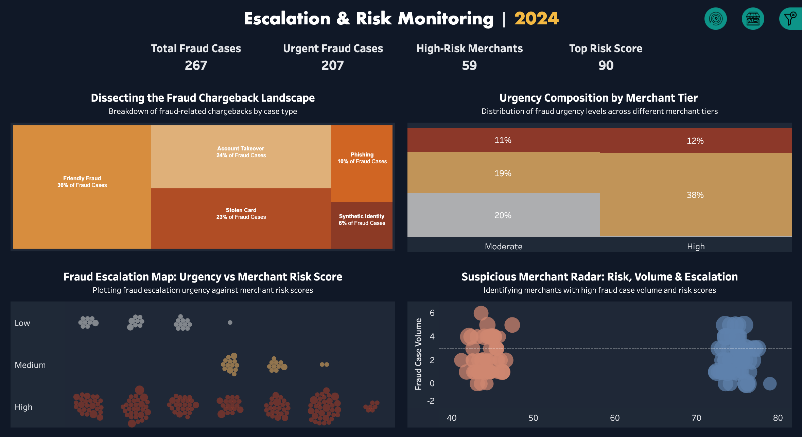
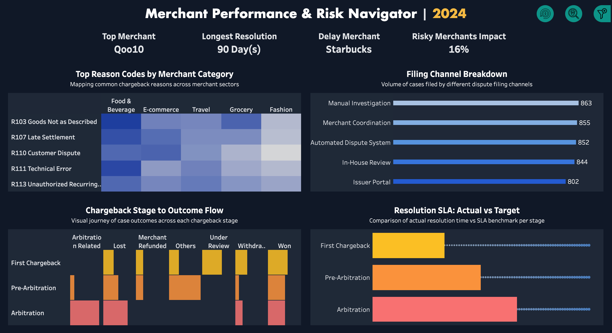

# dispute-risk-analytics
Dispute &amp; Risk Analytics Suite using Python + Tableau

---

## 📊 Dashboards & Case Studies

### 1. Dispute & Resolution Tracker
**Problem:** SLA breaches and low win rates lead to financial losses.  
**Approach:** Python dataset + Tableau KPIs for SLA %, resolution times, and outcomes.  
**Solution:** Dashboard tracking disputes vs SLA benchmarks, win/loss trends, resolution variability.  
**Impact:** Identified SLA gap (57% vs 95%), long avg resolution (42 days), and low win rate (40%).  

---

### 2. Escalation & Risk Monitoring
**Problem:** Fraudulent disputes escalate quickly, creating urgent financial and operational risk.  
**Approach:** Modeled fraud type, urgency, and merchant risk using synthetic data.  
**Solution:** Dashboard with fraud treemap, urgency vs merchant risk scatterplot, suspicious merchant radar.  
**Impact:** Revealed 59 high-risk merchants, flagged 235 urgent cases, and improved fraud response prioritization.  

---

### 3. Merchant Performance & Risk Navigator
**Problem:** Lack of transparency on vendor/merchant performance drives repeat disputes.  
**Approach:** Linked reason codes, filing channels, and case outcomes at merchant level.  
**Solution:** Dashboard with reason code heatmap, filing channel breakdown, SLA outcome flows.  
**Impact:** Identified delay merchant (90-day resolution), quantified high-risk merchants (16% of disputes), optimized filing channels.  

---

## 📸 Dashboard Previews

- 
- 
- 

---

## 🔗 Links
- [Tableau Public Dashboards](#)  
- [Notion/Portfolio Case Study](#)  
- [LinkedIn Post Showcase](#)  

---

## 👨‍💻 Author
**Muhammad Akmal Danial Bin Mohd Fadzlen**  
📍 Senior Financial Operations & Treasury | Aspiring Data & Process Analyst  
