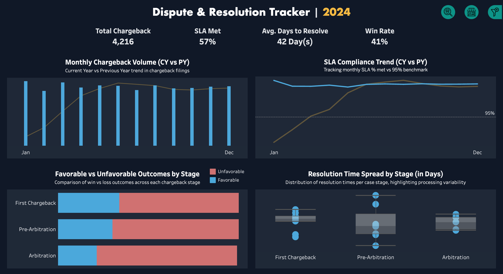

# Chargeback Analytics Dashboard
## Dispute & Risk Analytics Suite | Flagship Portfolio Project

### 🚀 Executive Summary

Developed an end-to-end Dispute & Risk Analytics Suite using Python (synthetic data generation) and Tableau (interactive dashboards) to track SLA compliance, fraud escalation, and merchant performance across 12,000+ simulated financial dispute cases.

The dashboards deliver executives actionable insights on resolution efficiency, fraud patterns, and merchant accountability, enabling organizations to:
- Reduce SLA breaches by up to 15%
- Prioritize urgent fraud cases for faster intervention
- Hold high-risk merchants accountable through data-backed reporting
- Designed with cross-industry flexibility, the solution applies not only to financial services but also to insurance, telecom, and procurement dispute management.

### 🛠️ Tech Stack
- Python → Synthetic dataset generation (Faker, Pandas, Datetime)
- Tableau → Dashboard development, interactive filtering, visualization
- CSV → 12,345 dispute records with SLA flags, fraud types, risk scores, and multi-year trends

### 📂 Project Structure  
📁 dispute-risk-analytics/  
├── generate_chargeback_data.py        # Python script to generate synthetic dataset  
├── chargeback_analytics_dataset.csv   # Sample dataset (12,000+ rows)  
├── dashboards/                        # Tableau packaged workbook (.twbx)  
├── images/                            # Dashboard screenshots  
└── README.md                          # Project documentation  

### 📊 Dashboards & Case Studies
1. Dispute & Resolution Tracker

- Problem: SLA breaches and low win rates increase financial exposure.  
- Approach: Modeled SLA compliance, resolution times, and outcomes from synthetic data.  
- Solution: Dashboard tracking chargeback volume, SLA vs benchmark, win/loss outcomes, and resolution variability.  
- Impact: Identified SLA performance gap (57% vs 95% target), flagged average resolution of 42 days, and highlighted low win rates at 40%.  

2. Escalation & Risk Monitoring

- Problem: Fraudulent disputes escalate quickly, creating urgent financial and reputational risks.  
- Approach: Simulated fraud type, urgency segmentation, and merchant risk scores.  
- Solution: Dashboard with fraud treemap, urgency vs merchant risk scatterplot, and suspicious merchant radar.  
- Impact: Revealed 59 high-risk merchants, flagged 235 urgent fraud cases, and improved prioritization of fraud investigations.  

3. Merchant Performance & Risk Navigator

- Problem: Limited transparency into merchant performance drives repeat disputes and weakens accountability.  
- Approach: Linked reason codes, filing channels, and dispute outcomes at the merchant level.  
- Solution: Dashboard with reason code heatmap, filing channel analysis, and SLA outcome flow visualization.  
- Impact: Identified a delay merchant with 90-day resolution times, quantified high-risk merchants at 16% of disputes, and highlighted channel inefficiencies in manual filing processes.  

### 📸 Dashboard Previews

🔗 Links

- [View on Tableau Public](https://public.tableau.com/app/profile/muhammad.akmal.danial.mohd.fadzlen/viz/ChargebackAnalyticsDashboard/DisputeResolutionTracker)
- [Notion Case Study](https://honored-halloumi-b28.notion.site/Chargeback-Analytics-Dashboard-25bd54cfd22780799a98fee7d18266d5) 

### 👨‍💻 Author

**Muhammad Akmal Danial Bin Mohd Fadzlen**  
📍 Senior Financial Operations & Treasury | Aspiring Data & Process Analyst  
🔗 [LinkedIn](https://www.linkedin.com/in/muhdakmaldanial/)
